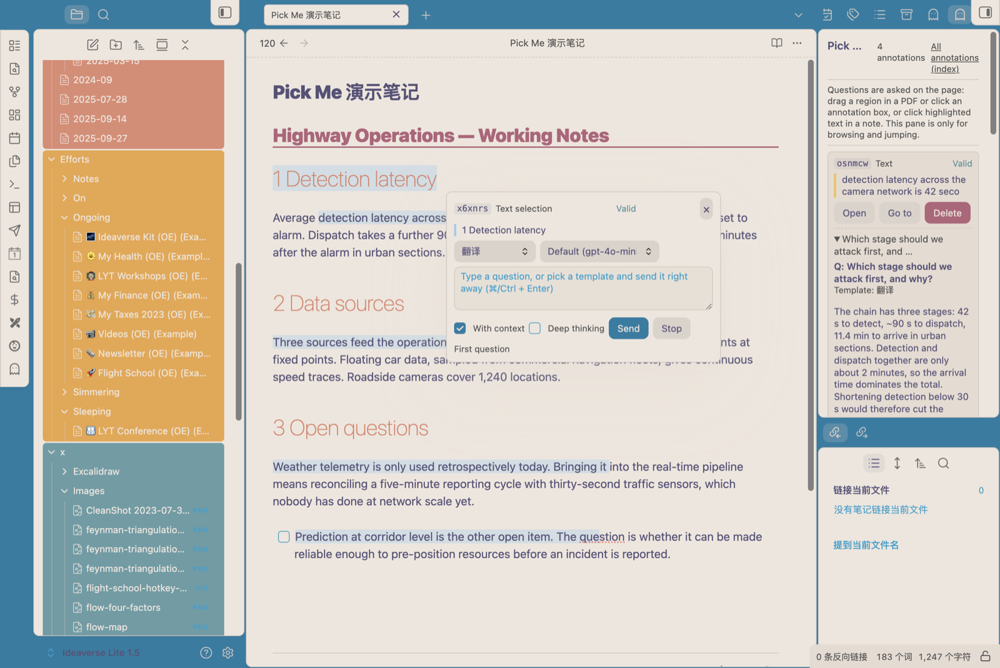
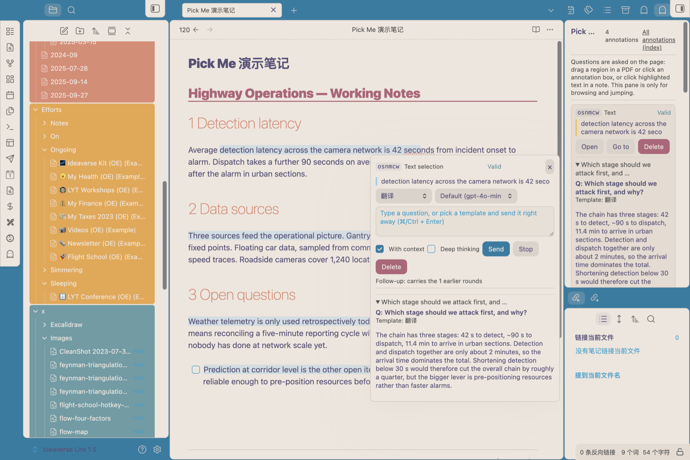
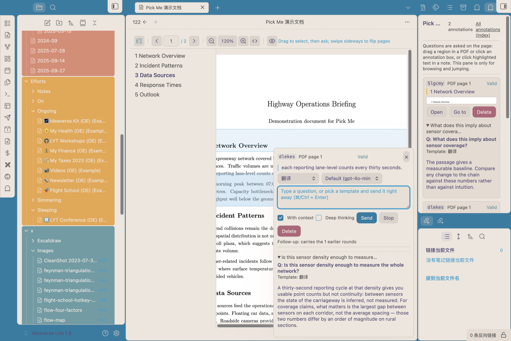
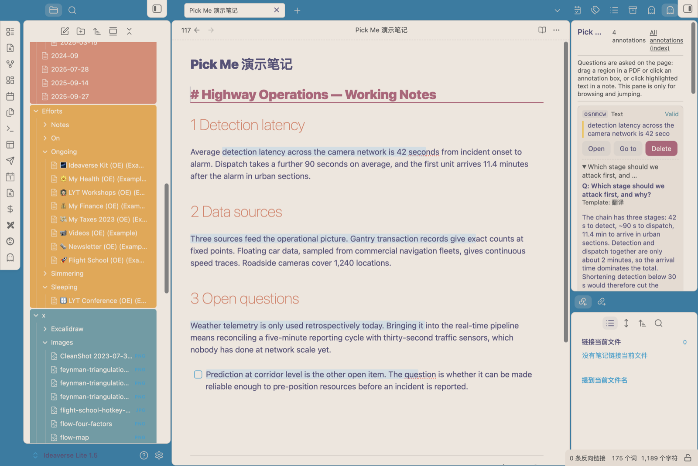
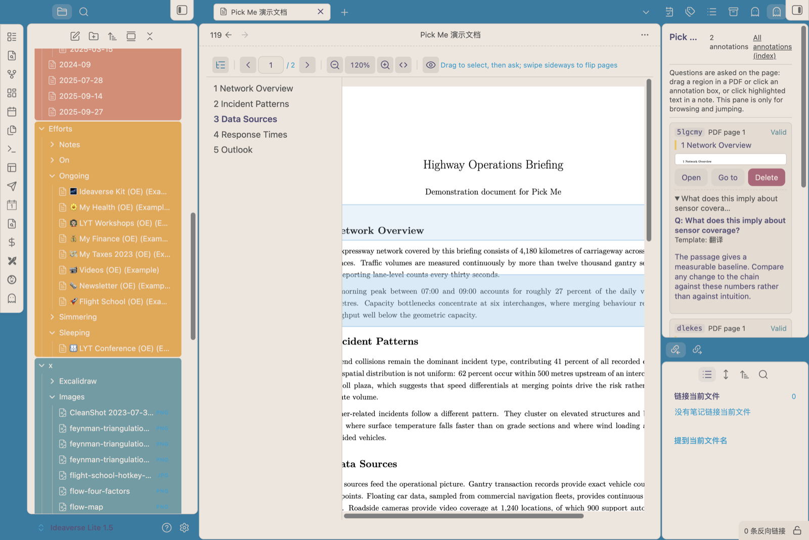

# Pick Me

Annotate and ask questions about what you select — in notes and in PDFs — without leaving the page.

**English** | [中文](README.zh.md)

Select text in a note, or drag a rectangle over a PDF page, and a panel opens right there: pick a template or ask your own question. Every annotation lives in its own Markdown file and stays linked to the source — the original document is never modified, not a single byte.

## Screenshots

| Select and ask | The answer, stored with the annotation |
| --- | --- |
|  |  |
|  |  |

In a PDF you can annotate two ways, and the toolbar switches between them: drag a **rectangle** over a region (its text and a screenshot go to the model together), or drag a **highlighter stroke** across text — the stroke snaps to the lines underneath and renders as a clean band, however shaky your hand was. The two have distinct jobs: the **highlighter highlights and holds a one-line note** — while you drag you see your own stroke, it snaps into a clean band on release, and only the stretch you actually painted is covered — while a **rectangle** opens the ask panel the moment you finish it. (Inside the note box, “Ask AI instead” switches the same panel to the question composer.) Which one is live is visible both on the toolbar (the active icon keeps an accent background) and in the pointer: crosshair for a region, a marker for the highlighter. The two can be combined on the same annotation.

Drag a rectangle over a PDF page — the text of that region and its screenshot go to the model together, and the box stays on the page to reopen later:



## Install

- **Community plugins** (after this plugin is published): Settings → Community plugins → Browse → search *Pick Me* → Install → Enable.
- **BRAT** (beta builds, works before publication): install [BRAT](https://github.com/TfTHacker/obsidian42-brat), then *Add beta plugin* → `<your-github-user>/pickme`.
- **Manual**: put `main.js`, `manifest.json` and `styles.css` into `<vault>/.obsidian/plugins/pickme/`, then enable it in Settings.

Desktop only (`isDesktopOnly`) — the built-in pdf.js viewer and region screenshots need desktop capabilities.

## Network use and privacy

This plugin collects nothing and has **no telemetry**. It does need network access to the model endpoint *you* configure:

- The only destination it ever contacts is the **OpenAI-compatible endpoint you enter in the settings**. The text you select (and optionally the PDF region screenshot) is sent there to generate an answer; what happens to it is up to whichever provider you point it at.
- Your **API key** is stored in plain text in `.obsidian/plugins/pickme/data.json`, like any other Obsidian plugin's settings. It is never sent anywhere except the endpoint you configured.
- Everything except "asking a question" works **offline**: annotations, anchors, highlights and the index are local operations. Note text is only sent when you ask, and only the selection (plus optional surrounding context, and the whole note if a template opts in via `pickme_include_note`).
- PDF rendering needs no downloads: pdf.js's CMap tables and standard fonts are **inlined into `main.js`** at build time.
- The plugin writes only inside your vault (by default `.obsidian/plugins/pickme/`: annotation files, templates, the generated index) and reads nothing outside the vault.

## Use it

Interactions happen on the page. The sidebar is only for reviewing existing annotations.

### In a note (Markdown)

1. Select some text → right-click → **Pick Me: Ask or annotate** (or run the same command from the command palette).
2. The plugin inserts an empty anchor tag pair around the selection; the text and formatting inside are untouched.
3. A panel opens next to the selection: choose a template or type your own question. Asking again on the same annotation is a follow-up — the previous exchanges are sent along.
4. Click the highlighted text later to reopen that annotation's panel.

### In a PDF

1. PDFs open in Pick Me's built-in pdf.js viewer by default (can be turned off in the settings).
2. **Drag** a rectangle over the page to annotate — regions only; a single click never creates an annotation.
3. Releasing the mouse creates the annotation and opens the panel at the same spot. The region screenshot goes to the model together with the text extracted from that region.
4. Click an existing box on the page to reopen that annotation with its history.
5. Close the panel with `×` or `Esc`. A box you just drew that has no question yet is **undone** when you close the panel; once you have asked something it stays.

**All pages sit in one scroll container**, like the built-in PDF reader: the scrollbar represents the whole document, and the page box follows it.

| Way to move | How |
| --- | --- |
| Wheel / trackpad | Scroll continuously; PageUp/PageDown/Home/End scroll natively |
| Buttons / page box | Toolbar previous/next page, or type a page number and press Enter |
| Trackpad swipe | Swipe sideways to flip a page (needs ~120px so it doesn't fire by accident) |
| Keyboard | ← / → flip pages (the page box keeps focus; when zoomed in far enough to scroll sideways, arrows stay native) |

Only pages near the viewport are rendered; far-away canvases are released and repainted when you scroll back, so a 100-page PDF does not eat hundreds of MB.

**Outline**: PDFs with bookmarks (usually standards, manuals, datasheets) get an outline panel on the left; click an entry to jump to that page. PDFs without bookmarks get no outline button at all. The open/closed state is remembered.

The toolbar is grouped by function, left to right, separated by hairline dividers: **outline** (only when the PDF has bookmarks) | **paging** (previous / page box / page count / next) | **zoom** (out / percentage / in / fit width — click the percentage to snap back to 100%) | **display** (highlight toggle: turn it off for a clean PDF). Toolbar buttons are icon-only with tooltips, and the grey text at the far right is the current status (it ellipsizes when narrow).

### Annotation index (one screen for the whole vault)

Run the command **Open annotation index** to get a sidebar listing every annotation in the vault, grouped by source document: selection snippet or PDF page, question count, anchor id and creation time.

- Click a document name to open it; click an entry to open the source and jump to that annotation. Fully keyboard operable (Tab + Enter).
- PDF annotations carry a thumbnail of the region; text annotations show the snippet.
- Filter box on top (document name, selection text or anchor id).
- Annotations whose anchor can no longer be found in the source (you edited that paragraph, or deleted the tag pair) are **never deleted** and never mixed into the normal list: they collect into a collapsible `Stale (N)` row at the end of each group, with the reason spelled out. Use the command **Rebind stale anchors** to re-attach one by re-selecting the text in the source.
- The index reads the annotation files directly, so it is always current. The plugin also maintains an `annotations-index.md` summary inside its own (hidden) plugin folder — an internal artifact with no setting; handlers that want it can point Dataview at the plugin folder.

### Templates

A template is just a prompt. Three are built in — **Explain / Summarize / Translate** — and every `.md` file in the template folder is a template; the **file name is the name in the dropdown**.

Variables: `{{选区}}` (selection), `{{提问}}` (question), `{{上下文}}` (context), `{{笔记标题}}`, `{{源路径}}`, `{{页码}}`, `{{已有批注}}`, `{{区域图片}}`. A line whose variables are all empty is dropped entirely, so optional paragraphs are safe.

Frontmatter can override per-template behaviour:

```yaml
pickme_model: qwen/qwen3.8-flash-next   # model for this template (empty = default)
pickme_temperature: 0.7                  # override temperature
pickme_include_note: false               # also send the whole note
pickme_vision: true                      # send the PDF region screenshot
pickme_context: false                    # attach surrounding context
```

### Model channel

Point the plugin at any OpenAI-compatible endpoint (official API, a gateway, an intranet service). The settings cover the base URL, API key, default model, temperature, streaming, deep thinking, an optional vision model, and the maximum output length. **Test connection** sends a minimal request to check the credentials.

Two things worth knowing:

- **Deep thinking** (on by default) makes the model reason before answering: better answers, slower. The reasoning budget is separate and does **not** consume the maximum output length.
- **Interface language** switches the plugin's own UI between English and Chinese, immediately, without a restart. It never translates your notes or annotation files.

Full section-by-section explanation of every setting: [README.zh.md](README.zh.md#设置项说明) (Chinese).

## Limitations

- `main.js` is about 3.8 MB because pdf.js's CMap tables and standard fonts are inlined — the price of needing no network for PDF rendering. They ship as one gzip stream per group and are decompressed once, on demand, so the download stays as small as this feature allows.
- Desktop only.
- When the window is minimized or fully occluded, Chromium stops `requestAnimationFrame` and pdf.js rendering pauses; it repaints when the window returns.
- Anchor tags are visible in source mode (`<pickme id="xxxxxx"></pickme>`) but hidden in editing and reading views.
- Highlights rely on the reading-view post-processor and a CodeMirror extension; if another plugin decorates the same text, Obsidian's render wins.

## Development

```bash
npm install
npm run dev        # watch build
npm run verify     # typecheck + unit tests + build + smoke test
npm run build      # produce main.js
node scripts/install.mjs "/path/to/vault"          # symlink the project into a vault (dev)
node scripts/install.mjs "/path/to/vault" --copy   # copy the built files instead
```

The repository ships the plugin source and build scripts only. Design and acceptance documents stay in the private development repository.

`src/generated/pdfAssets.ts` (pdf.js CMap tables and standard fonts, ~1.8 MB of base64) **is committed on purpose**: static analysis and type checking have to resolve it, and an unresolved import degrades to `any`, which shows up as spurious `unsafe-*` findings in the plugin review. Regeneration is deterministic, and CI fails if it drifts from `pdfjs-dist`.

## License and third-party components

- This plugin: MIT, see [LICENSE](./LICENSE).
- Bundles [pdf.js](https://github.com/mozilla/pdf.js) (`pdfjs-dist@4.10.38`, Apache-2.0) for PDF rendering; its CMap tables and standard fonts are inlined by `scripts/inline-pdf-assets.mjs`.
- pdf.js contains font-rendering code paths that build functions with `new Function`. Pick Me disables them (`isEvalSupported: false` in `src/pdf/pdfjs.ts`), so no generated code is ever evaluated — the automated review still shows a "dynamic code execution" note because that code is present in the bundle.
